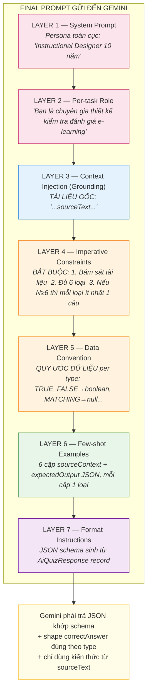
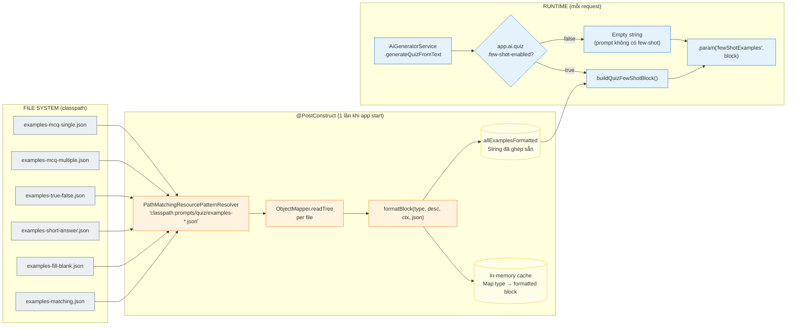

# AI Prompt Engineering — Sơ đồ kiến trúc

Tài liệu này chứa các sơ đồ Mermaid mô tả luồng prompt engineering trong [AiGeneratorService](../src/main/java/com/scorm/generator/service/AiGeneratorService.java). Các sơ đồ render trực tiếp trong VS Code (cài extension Markdown Preview Mermaid Support) hoặc GitHub.

---

## 1. Sơ đồ tổng thể — Pipeline đầu cuối

Mô tả toàn bộ vòng đời một request AI: từ HTTP request → ráp prompt → gọi LLM → parse → trả DTO.

```mermaid
flowchart LR
    subgraph IN["INPUT LAYER"]
        direction TB
        REQ["HTTP Request<br/>POST /ai/generate-quiz"]
        DTO_IN["Request DTO<br/>(GenerateQuizRequest)"]
        REQ --> DTO_IN
    end

    subgraph ASM["PROMPT ASSEMBLY"]
        direction TB
        FB["Default Fallback<br/>null → 'Chưa xác định'"]
        TPL["User Prompt Template<br/>(Java text block với {placeholder})"]
        SP["System Prompt<br/>'Instructional Designer 10 năm'"]
        FS["QuizExampleLoader<br/>6 JSON file ví dụ"]
        FMT["BeanOutputConverter<br/>JSON schema từ Java record"]

        FB --> TPL
        FS -. inject {fewShotExamples} .-> TPL
        FMT -. inject {formatInstructions} .-> TPL
    end

    subgraph LLM["LLM CALL"]
        direction TB
        CC["ChatClient.prompt<br/>.user(...).param(...)"]
        GAI["Gemini 2.5 Pro<br/>temperature=0.7"]
        CC --> GAI
    end

    subgraph OUT["OUTPUT PROCESSING"]
        direction TB
        RAW["Raw String<br/>(có thể có ```json fence)"]
        STRIP["stripJsonFence()"]
        CONV["BeanOutputConverter<br/>.convert(json)"]
        DTO_OUT["Response DTO<br/>(AiQuizResponse)"]
        RAW --> STRIP --> CONV --> DTO_OUT
    end

    DTO_IN --> FB
    SP --> CC
    TPL --> CC
    GAI --> RAW

    classDef input fill:#e3f2fd,stroke:#1976d2,color:#0d47a1
    classDef assembly fill:#fff3e0,stroke:#f57c00,color:#e65100
    classDef llm fill:#f3e5f5,stroke:#7b1fa2,color:#4a148c
    classDef output fill:#e8f5e9,stroke:#388e3c,color:#1b5e20

    class REQ,DTO_IN input
    class FB,TPL,SP,FS,FMT assembly
    class CC,GAI llm
    class RAW,STRIP,CONV,DTO_OUT output
```



---

## 2. Cấu trúc layered của một prompt (Quiz)

Cách các kỹ thuật prompt engineering xếp chồng trong một prompt cụ thể (lấy `generateQuizFromText` làm ví dụ).



---

## 3. Few-shot Examples — Luồng load và inject

Cách `QuizExampleLoader` đưa 6 file JSON vào prompt khi service khởi động.



---

## 4. Bản đồ kỹ thuật prompt engineering

Phân loại các kỹ thuật prompt engineering đang dùng theo nhóm chức năng.

```mermaid
mindmap
  root((Prompt<br/>Engineering<br/>Techniques))
    Identity & Tone
      Persona system prompt
      Per-task role
    Structured Output
      BeanOutputConverter<br/>schema sinh từ DTO
      Output post-processing<br/>stripJsonFence
    Templating
      Java text block + {placeholder}
      param binding
      Default fallback cho null
    Context & Grounding
      Document context injection<br/>Tika reader
      Course context injection
      Page content injection
      Self-evaluation flag<br/>groundedInCourse
    Constraints
      Negative prompting<br/>TUYỆT ĐỐI KHÔNG
      Whitelist constraint<br/>HTML tags, 6 question types
      Conditional rule<br/>nếu N greater 6 thì mỗi loại ít nhất 1
      Fallback path<br/>không đủ dữ liệu → từ chối
    Few-shot Examples
      Quiz<br/>6 ví dụ per type
      Page content<br/>positive + negative
      Anti-rot test<br/>parse qua DTO ở CI
    Layout & Safety
      Sectioned heading<br/>viết HOA
      Delimiter<br/>===== cô lập user data
      Data convention<br/>shape per type
    Operational
      Feature flag<br/>tắt nhanh khi regression
      Temperature 0.7<br/>cố định toàn cục
```

---

## 5. So sánh prompt trước và sau khi có Few-shot

```mermaid
flowchart TB
    subgraph BEFORE["TRƯỚC FEW-SHOT (zero-shot)"]
        B1["System Prompt"]
        B2["Per-task Role"]
        B3["Context (sourceText)"]
        B4["Constraints (BẮT BUỘC)"]
        B5["Data Convention<br/>(prose only)"]
        B6["Format Instructions<br/>(JSON schema)"]
        B1 --> B2 --> B3 --> B4 --> B5 --> B6
        B7{"Model phải tự<br/>suy luận shape<br/>của correctAnswer"}
        B6 --> B7
        B8["⚠️ Risk: shape mismatch<br/>→ parse fail<br/>→ SCORM chấm sai"]
        B7 --> B8
    end

    subgraph AFTER["SAU FEW-SHOT (current)"]
        A1["System Prompt"]
        A2["Per-task Role"]
        A3["Context (sourceText)"]
        A4["Constraints (BẮT BUỘC)"]
        A5["Data Convention"]
        A6["Few-shot: 6 ví dụ JSON<br/>cụ thể cho mỗi type"]
        A7["Format Instructions"]
        A1 --> A2 --> A3 --> A4 --> A5 --> A6 --> A7
        A8{"Model bắt chước<br/>shape từ ví dụ"}
        A7 --> A8
        A9["✅ Shape đúng<br/>→ parse OK<br/>→ SCORM chấm đúng"]
        A8 --> A9
    end

    classDef bad fill:#ffebee,stroke:#c62828,color:#b71c1c
    classDef good fill:#e8f5e9,stroke:#2e7d32,color:#1b5e20
    class B7,B8 bad
    class A8,A9 good
```



---

## Cách render

| Công cụ | Cách dùng |
|---|---|
| VS Code | Cài extension *Markdown Preview Mermaid Support* (bierner.markdown-mermaid) → mở file → `Cmd+Shift+V` |
| GitHub | Render tự động khi commit lên repo |
| IntelliJ | Cài plugin *Mermaid* → preview tab |
| Web | Dán code Mermaid vào https://mermaid.live |
| Export ảnh | `mmdc -i AI_PROMPT_ENGINEERING_DIAGRAM.md -o diagram.png` (cài `@mermaid-js/mermaid-cli`) |
